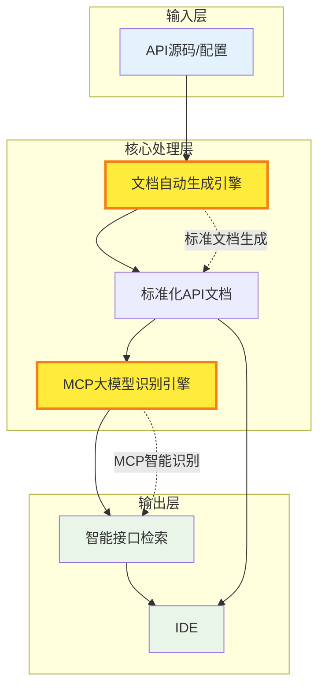

# OAS-MCP

一个将OpenAPI规范转换为MCP（Model Context Protocol）工具的服务器，支持HTTP、SSE和STDIO模式。

## 静态文件服务

当使用HTTP或SSE模式启动服务器时，`public`目录将自动作为静态资源目录提供服务：

- **HTTP模式**: 静态文件通过根路径 `/` 提供服务，MCP请求通过 `/mcp` 端点处理
- **SSE模式**: 静态文件通过根路径 `/` 提供服务，SSE连接通过 `/sse` 端点处理
- **访问示例**: 
  - Swagger文档：`http://localhost:8080/swag.html`
  - API参考：`http://localhost:8080/api-reference`

## 功能特性

* **零样板代码** - 提供您的 `swagger.json` 文件即可开始服务
* **灵活部署** - 可作为 CLI、长期运行的守护进程或在 Docker/Kubernetes 中运行
* **全部传输模式支持**:
  * `stdio` (默认)
  * `http` - StreamableHttp，最新的 MCP 协议
  * `sse` - 自托管长期运行事件源
* **可插拔认证** - Bearer token、basic auth、API keys、OAuth2 或无认证
* **运行时配置** - YAML 文件、CLI 标志或环境变量（前缀 `OAS_MCP_`）

## 架构图



## 快速开始

### 构建项目

```bash
go build -o oas-mcp ./main.go
```

### 运行

1. **STDIO 模式（默认）**:
   ```bash
   ./oas-mcp --swagger-file=swagger.json
   # 或
   ./oas-mcp --swagger-file=https://petstore.swagger.io/v2/swagger.json
   ```

2. **HTTP 模式**:
   ```bash
   # 使用本地文件
   ./oas-mcp --swagger-file=swagger.json --mode=http --port=8080
   
   # 使用远程URL
   ./oas-mcp --swagger-file=https://petstore.swagger.io/v2/swagger.json --mode=http --port=8080
   
   # HTTP模式自动启用静态文件服务：
   # - MCP API: http://localhost:8080/mcp
   # - Swagger文档: http://localhost:8080/swag.html
   # - 静态资源: http://localhost:8080/ (public目录)
   ```

3. **使用配置文件**:
   ```bash
   ./oas-mcp --config=config.yaml
   ```

### URL 支持

OAS-MCP 支持直接从远程URL加载OpenAPI/Swagger规范：

- **支持协议**: `http://` 和 `https://`（推荐）
- **自动检测**: 程序自动识别URL和本地文件路径
- **网络超时**: 30秒HTTP客户端超时
- **错误处理**: 完整的网络错误和HTTP状态码处理

**示例**:
```bash
# Swagger Petstore API
./oas-mcp --swagger-file=https://petstore.swagger.io/v2/swagger.json \
  --upstream-base-url=https://petstore.swagger.io/v2 \
  --auth-type=none

# 私有API（需要认证）
./oas-mcp --swagger-file=https://api.example.com/swagger.json \
  --upstream-base-url=https://api.example.com \
  --auth-type=bearer \
  --auth-token=your-token
```

详细的URL支持文档请参见 [URL_SUPPORT.md](URL_SUPPORT.md)。

### 配置

创建 `config.yaml` 文件：

```yaml
# 支持本地文件或远程URL
swagger_file: "swagger.json"  # 或 "https://petstore.swagger.io/v2/swagger.json"

server:
  mode: "stdio"  # stdio, http, sse
  host: "localhost"
  port: 8080

upstream:
  base_url: "https://api.example.com"
  timeout: 30

auth:
  type: "none"  # none, bearer, basic, apikey, oauth2
  token: ""
  username: ""
  password: ""
  api_key: ""

logging:
  level: "info"  # debug, info, warn, error
  disable_console: false
  file: ""
```

### 环境变量

所有配置选项都可以通过环境变量设置，使用 `OAS_MCP_` 前缀：

```bash
# 设置日志级别
export OAS_MCP_LOG_LEVEL=debug

# 设置服务器模式和端口
export OAS_MCP_MODE=http
export OAS_MCP_PORT=8080

# 设置上游 API
export OAS_MCP_UPSTREAM_BASE_URL=https://api.example.com

# 设置认证
export OAS_MCP_AUTH_TYPE=bearer
export OAS_MCP_AUTH_TOKEN=your-token
```

### 命令行选项

```bash
./oas-mcp --help
```

主要选项：
- `--swagger-file`: OpenAPI/Swagger 文件路径或URL（默认: swagger.json）
- `--mode`: 服务器模式 (stdio, http, sse)（默认: stdio）
- `--config`: 配置文件路径
- `--upstream-base-url`: 上游 API 基础 URL
- `--auth-type`: 认证类型 (none, bearer, basic, apikey)
- `--version`: 显示版本信息

## 在 Claude Desktop 中运行

将以下配置添加到您的 **Cursor** 配置中（⚙️ _设置 → MCP_）：

```json
{
  "mcpServers": {
    "YourMCP": {
      "command": "/path/to/oas-mcp",
      "args": [
        "--swagger-file=/path/to/swagger.json",
        "--upstream-base-url=https://your-api.com"
      ]
    }
  }
}
```

## 认证支持

支持多种认证方式：

### Bearer Token
```yaml
auth:
  type: "bearer"
  token: "your-bearer-token"
```

### Basic Auth
```yaml
auth:
  type: "basic"
  username: "your-username"
  password: "your-password"
```

### API Key
```yaml
auth:
  type: "apikey"
  api_key: "your-api-key"
```

## 示例

项目包含一个示例 OpenAPI 规范 (`swagger.json`)，定义了一个简单的用户管理 API，包含以下端点：

- `GET /users` - 获取所有用户
- `POST /users` - 创建新用户
- `GET /users/{userId}` - 根据 ID 获取用户

运行示例：

```bash
./oas-mcp --swagger-file=swagger.json --upstream-base-url=https://jsonplaceholder.typicode.com
```

## 开发

### 项目结构

```
├── main.go              # 主程序入口
├── internal/            # 内部模块
│   ├── config/          # 配置管理
│   ├── logger/          # 日志管理
│   ├── parser/          # OpenAPI 解析器
│   ├── requester/       # HTTP 请求处理
│   └── server/          # MCP 服务器实现
├── config.yaml          # 示例配置文件
├── swagger.json         # 示例 OpenAPI 规范
└── README.md
```

### 依赖管理

```bash
go mod tidy
```

### 构建

```bash
go build -o oas-mcp ./main.go
```

## 许可证

本项目采用 Apache License 2.0 许可证 - 详见 [LICENSE](LICENSE) 文件。